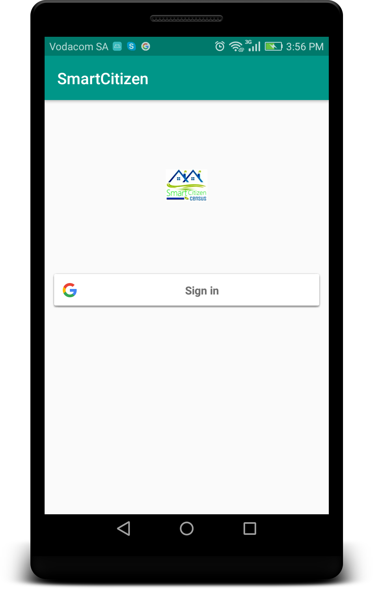
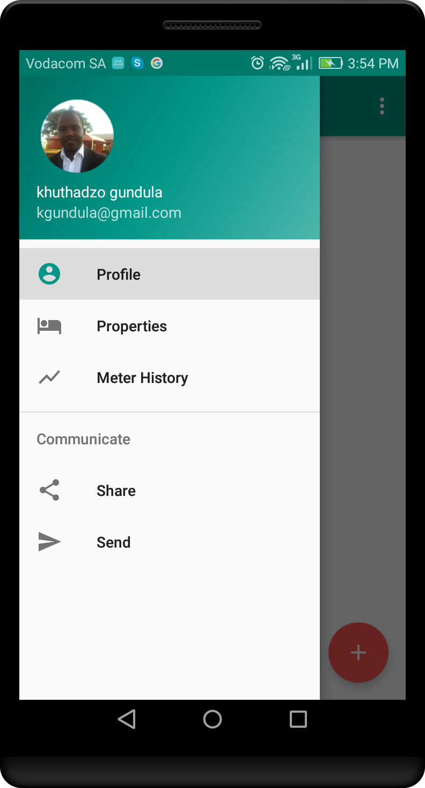
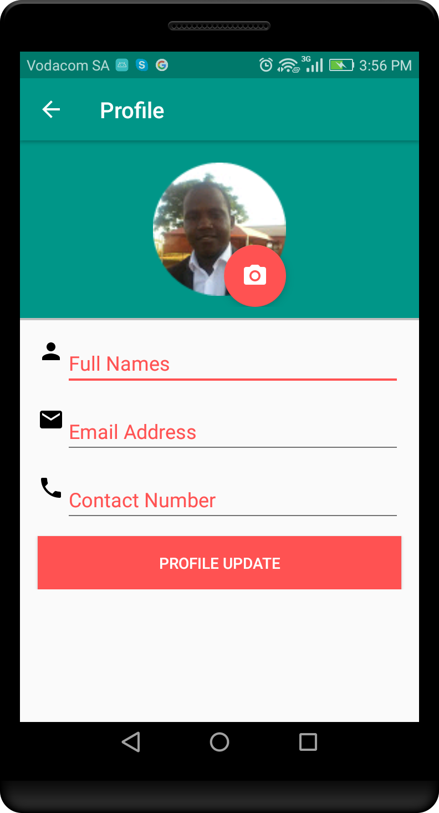

# SmartCitizen 
City of Tshwane - Electricity Meter Submission

<b>Smart Citizen</b> allows property owners to log their meter readings (water or electricity) and e-mail them to their municipality (at least for Tshwane Municipality). Users need to register and add a property to use the service.

Meter Reading allows a user (citizens) to record their meter readings on the property for submission to the municipality and will allow the municipality to issues the correct invoices for their clients (citizens) which will reduce incorrect billing.

        
